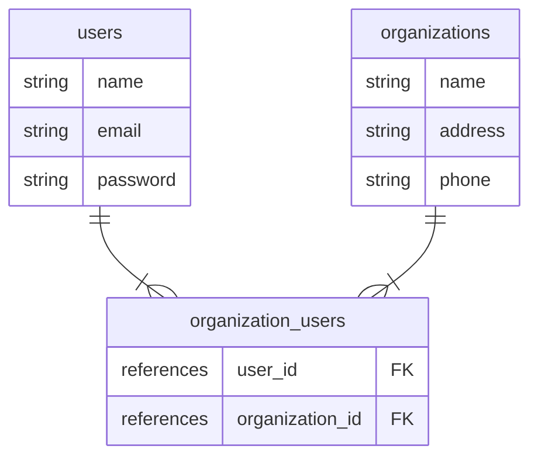

# 多対多（関連付け）の注意点

新規作成で関連付け先情報も同時保存することを考える場合、多対多は1対多と少し異なる点があるので注意（冷静に考えれば当たり前だが時々混乱する）。

以下の関連付けを例にまとめる↓

## ER図



## モデル

```ruby
# Userモデル

has_many :organization_users, dependent: :destroy
has_many :organizations, through: :organization_users
```

```ruby
# Organizationモデル

has_many :organization_users, dependent: :destroy
has_many :users, through: :organization_users
```

```ruby
# OrganizationUserモデル

belongs_to :user
belongs_to :organization
```

## 注意点

多対多の場合、以下のように書いてもorganizationsテーブルにレコードは作成されるが、organization_usersテーブルにはレコード（current_userのidと作成中のorganizationのid）が作成されない。

しかし、1対多（1:N = users:organizations）の場合は関連付け先の情報（current_userのid）がorganizationsテーブルに保存される。

```ruby
# organizationsコントローラー

def create
  @organization = current_user.organizations.build(organization_paramas)
  if @organization.save
    # 以下省略
  end
end

private

def organization_params
  params.require(:organization).permit(:name, :address, :phone)
end
```

つまり多対多の場合、上記のように書いても**current_userと、新規作成したorganizationは関連付けされない**（中間テーブルにレコードが登録されていないため）。

ただし、`current_user.organizations.create(organization_paramas)`の場合は中間テーブルにもレコードが作成される。

## 中間テーブルにも同時にレコードを作成する方法

方法はいくつかあると思うが、以下のようにパラメータにUserのidを渡してあげるよう実装するとorganization_usersテーブルにもレコードが自動登録される

```ruby
# Organizationsコントローラー

def create
  @organization = Organization.new(organization_paramas)
  if @organization.save
    # 以下省略
  end
end

private

def organization_params
  params.require(:organization).permit(:name, :address, :phone).merge(user_ids: current_user.id)
end
```
