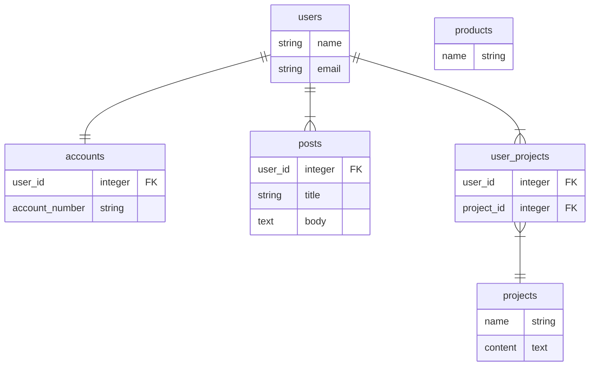

# Mermaid の基本文法

## 文法

```bash
# ER図を書くという宣言
erDiagram

# テーブル間の関連付を書く
users ||--|| accounts: "" # 1:1の関連付け
users ||--|{ posts: "" # 1:Nの関連付け
users ||--|{ user_projects: "" # 1:Nの関連付け（今回は中間テーブル用に利用）
user_projects }|--|| projects: "" # N:1の関連付け（今回は中間テーブル用に利用）

# テーブルの情報を書く
users {
  string name
  string email
}

accounts {
  user_id integer FK
  account_number string
}

posts {
  user_id integer FK
  string title
  text body
}

user_projects {
  user_id integer FK
  project_id integer FK
}

projects {
  name string
  content text
}

products {
  name string
}
```



## 参考

- https://mermaid-js.github.io/mermaid/#/./entityRelationshipDiagram
- https://zenn.dev/kyohei_shibuya/articles/0cafee2a1c1651
