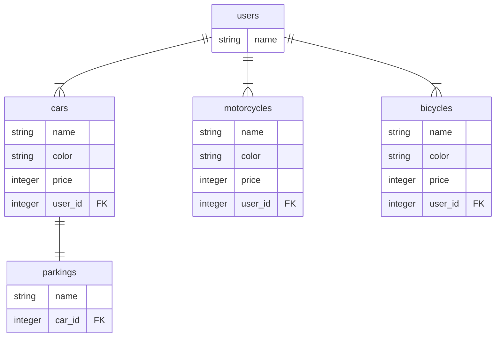
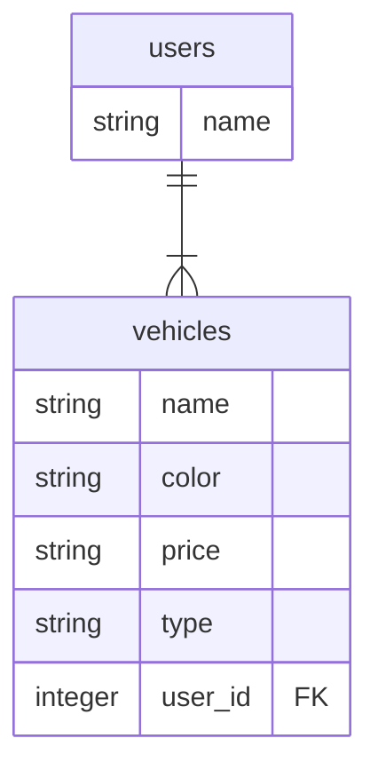

# STI（シングルテーブル継承）

同じカラムしか持たない複数のテーブルが必要な場合、STI を用いると用意するテーブルは 1 つで良いというメリットがある

## 概要

以下のようなテーブルを持ちたい場合、cars、motorcycles、bicycles は同じカラムしか持たないので STI を利用できる



## 実装方法

### テーブル作成

以下のようにテーブルを用意する（cars、motorcycles、bicycles テーブルは用意不要）

※ `type` カラムを用意することに注意

```
$ bundle exec rails g migration create_vehicle name:string color:string price:integer type:string
```

```
$ bundle exec rails db:migrate
```



### モデル作成

以下の 4 つのモデルを作成する

```ruby
# app/models/vehicle.rb

class Vehicle < ApplicationRecord
  belongs_to :user
end
```

```ruby
# app/models/car.rb

class Car < Vehicle
  has_one :parking
end
```

```ruby
# app/models/motorcycle.rb

class Motorcycle < Vehicle
end
```

```ruby
# app/models/bicycle.rb

class Bicycle < Vehicle
end
```

## 参考

- https://railsguides.jp/association_basics.html#%E3%82%B7%E3%83%B3%E3%82%B0%E3%83%AB%E3%83%86%E3%83%BC%E3%83%96%E3%83%AB%E7%B6%99%E6%89%BF-%EF%BC%88sti%EF%BC%89
